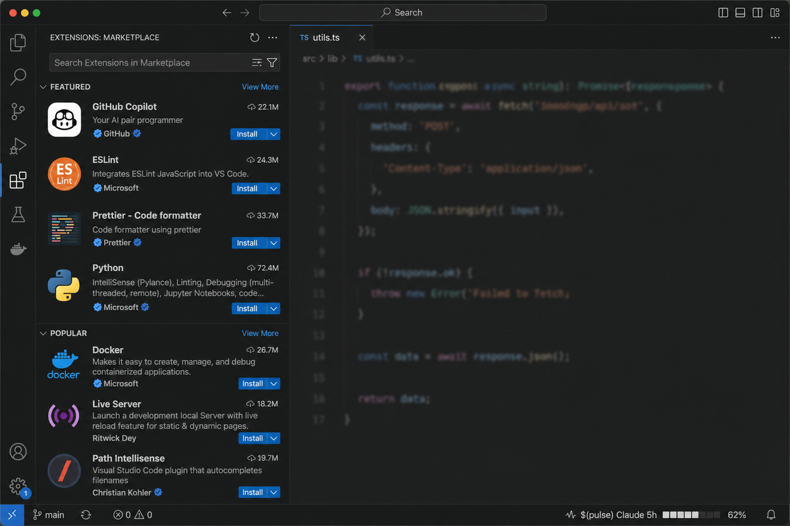
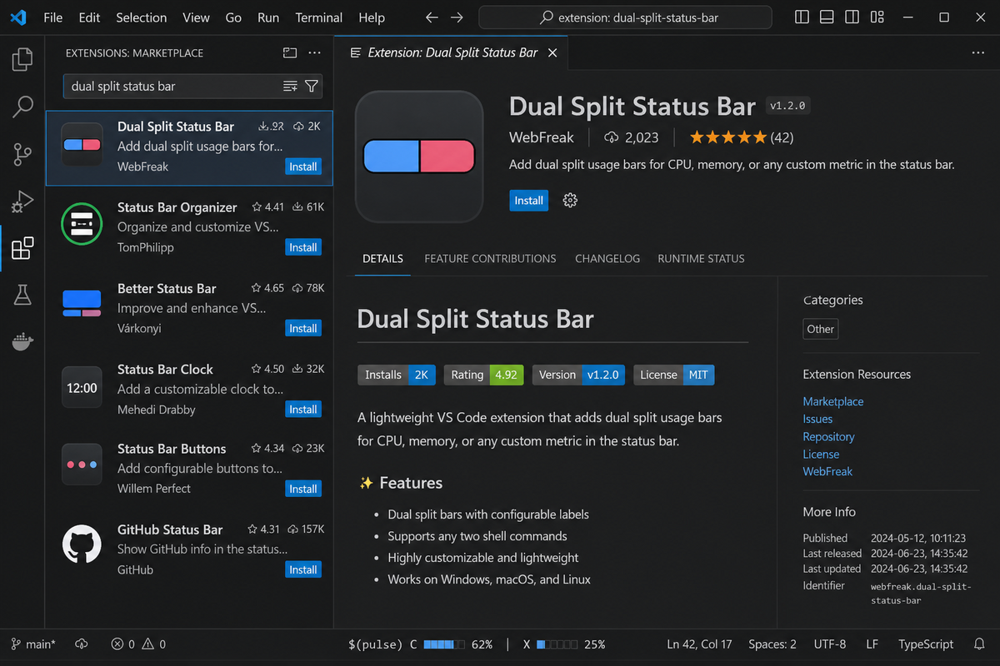
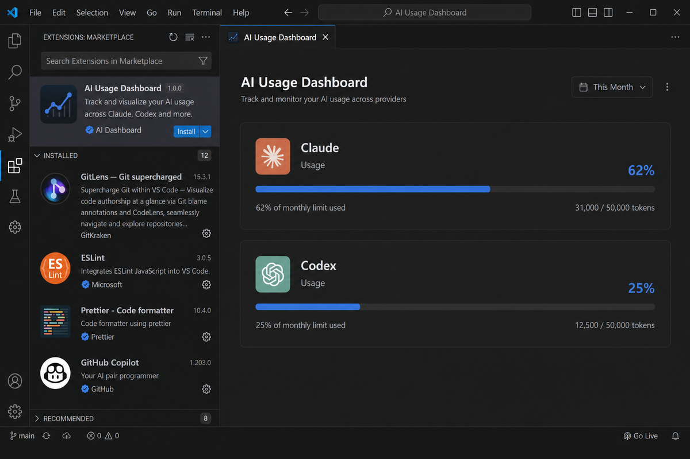

# AI Usage Bar

See your **Claude Code** and **Codex** rate-limit usage directly in the VS Code / Cursor status bar — updated live, with zero cloud calls.



## Features

- **Live usage bar** — 5-hour, weekly, and context window percentages
- **Claude Code + Codex** — auto-detects which CLI is active, or shows both at once
- **Dual split view** — `C ███░ 62% │ X █░░░ 25%` when both are running
- **Rich tooltip** — reset times, model, session cost, countdowns
- **Dashboard panel** — click the status bar for full details + setup help
- **One-click bridge install** — bundled scripts, no manual copying
- **Privacy-first** — local JSON files only, no transcript or credential reads
- **Works everywhere** — VS Code, Cursor, WSL, SSH, Dev Containers





## Install

### From Marketplace

1. Open **Extensions** in VS Code or Cursor
2. Search **AI Usage Bar**
3. Click **Install**

### From VSIX (manual)

```bash
code --install-extension claude-usage-bar-0.3.0.vsix
# or
cursor --install-extension claude-usage-bar-0.3.0.vsix
```

## Setup (2 minutes)

### Step 1 — Install bridge scripts

Open the Command Palette and run:

**`AI Usage: Install Bridge Scripts`**

### Step 2 — Configure Claude Code

Add to `~/.claude/settings.json`:

```json
{
  "statusLine": {
    "type": "command",
    "command": "node ~/.claude/claude-status-bridge.js",
    "refreshInterval": 1
  }
}
```

### Step 3 — Configure Codex CLI

Add to `~/.codex/config.toml`:

```toml
[[hooks]]
event = "AfterAgent"
command = "node ~/.codex/codex-status-bridge.js"
```

Then start the background poller in a terminal:

```bash
node ~/.codex/codex-usage-poller.js --interval 2000
```

### Step 4 — Reload

Run **`Developer: Reload Window`**. The status bar should appear within seconds.

> **Tip:** Run **`AI Usage: Copy Bridge Setup`** anytime to copy the full setup instructions.

## Status bar examples

| State | What you see |
|-------|-------------|
| Claude active | `Claude 5h █████░░░ 62%` |
| Codex active | `Codex 5h ██░░░░░░ 25%` |
| Both active | `C ███░ 62% │ X █░░░ 25%` |
| No data yet | `AI usage unavailable` |
| Data >2 min old | `Claude usage stale` |

## How activity detection works

The extension never spies on your processes or reads prompts. It uses three local signals:

1. **Bridge heartbeat** — bridge files update every 1–2s while a CLI is running
2. **Claude IDE lock** — `~/.claude/ide/*.lock` shows Claude is connected to your editor
3. **Focused terminal** — detects if your active terminal is running `claude` or `codex`

Set `claudeUsageBar.displayMode` to `auto` (default), `claude`, `codex`, or `both`.

## Privacy

| Reads | Does NOT read |
|-------|---------------|
| `~/.ai-usage-bridge/claude.json` | Claude transcript `.jsonl` files |
| `~/.ai-usage-bridge/codex.json` | Prompts or message content |
| `~/.claude/ide/*.lock` (workspace + PID) | `~/.claude/.credentials.json` |
| Codex `token_count` rate-limit events only | Any external servers |

## Commands

| Command | Description |
|---------|-------------|
| AI Usage: Open Dashboard | Full usage panel + setup guide |
| AI Usage: Install Bridge Scripts | Copy bundled scripts to `~/.claude` and `~/.codex` |
| AI Usage: Copy Bridge Setup | Copy setup instructions to clipboard |
| AI Usage: Refresh | Re-read bridge files |
| AI Usage: Open Claude/Codex State File | Inspect bridge JSON |

## Settings

| Setting | Default | Description |
|---------|---------|-------------|
| `displayMode` | `auto` | `auto`, `claude`, `codex`, `both` |
| `primaryMetric` | `fiveHour` | `fiveHour`, `sevenDay`, `context` |
| `activeThresholdMs` | `15000` | How fresh data must be to count as "live" |
| `barWidth` | `8` | Progress bar character width |
| `statusBarAlignment` | `right` | `right` or `left` |

## Compatibility

| Editor | Support |
|--------|---------|
| VS Code 1.85+ | ✅ |
| Cursor | ✅ |
| WSL / Remote SSH | ✅ |
| Windows / macOS / Linux | ✅ |

## Development

```bash
pnpm install
pnpm test      # 39 unit tests
pnpm run watch
pnpm run package
```

See [PUBLISHING.md](PUBLISHING.md) for the full release checklist.

## License

MIT — see [LICENSE](LICENSE)
